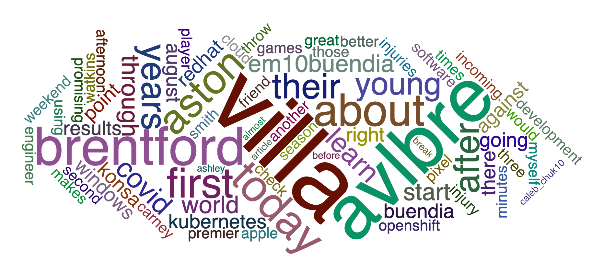

# Build your own social media analytics with Apache Kafka

This repository contains the demo for a conference call with the same name.
You can also have a look at the [slides](https://docs.google.com/presentation/d/18bmiZagwrAe8fnuuyBs45l1U5OHIGwK9pjLALpcC23E/edit?usp=sharing).

## Prerequisites

1) Install the Strimzi operator.
   The demo is currently using Strimzi 0.25.0, but it should work also with newer versions.
   If needed, follow the documentation at [strimzi.io](https://strimzi.io).

2) Create a Kubernetes Secret with credentials for your container registry.
   It should follow the usual Kubernetes format:
   ```yaml
   apiVersion: v1
   kind: Secret
   metadata:
     name: docker-credentials
   type: kubernetes.io/dockerconfigjson
   data:
     .dockerconfigjson: Cg==
   ```

3) Register for the Twitter API and create a Kubernetes Secret with the Twitter credentials in the following format:
   ```yaml
   apiVersion: v1
   kind: Secret
   metadata:
     name: twitter-credentials
   type: Opaque
   data:
     consumerKey: Cg==
     consumerSecret: Cg==
     accessToken: Cg==
     accessTokenSecret: Cg==
   ```

4) Deploy the Kafka cluster:
   ```
   kubectl apply -f 01-kafka-yaml
   ```

5) Once Kafka cluster is ready, deploy the Kafka Connect cluster which will also download the Camel Kafka Connectors for Twitter
   ```
   kubectl apply -f 02-connect-yaml
   ```

## Analyzing our own Twitter timeline

1) Deploy the Camel Twitter Timeline connector
   ```
   kubectl apply -f 10-timeline.yaml
   ```
   That should create a topic `twitter-timeline` and start sending the twitter statuses to this topic.
   You can use `kafkacat` to check them:
   ```
   kafkacat -C -b <brokerAddress> -o beginning -t twitter-timeline | jq .text
   ```

2) Deploy the Word Cloud and Tag Cloud applications:
   ```
   kubectl apply -f 11-timeline-word-cloud.yaml
   kubectl apply -f 12-timeline-tag-cloud.yaml
   ```
   They create Ingress resources to be able to access their API and UI.
   If needed, you might need to customize the Ingress or replace it with Route etc.
   The source code for both applications is part of the repository.
   You should see a word cloud similar to this:
   


## Doing a sentiment analysis of a search result

TODO

## Doing ad-hoc analysis

TODO

## Support commands

## Useful commands

### Reseting the streams applications:

1) Stop the application

2) Reset the application context
   ```
   bin/kafka-streams-application-reset.sh --bootstrap-servers <brokerAddress> --application-id <applicationId> --execute
   ```

3) Reset the offset
   ```
   hacking/kafka/bin/kafka-consumer-groups.sh --bootstrap-server <brokerAddress> --group <applicationId> --topic <sourceTopic> --to-earliest --reset-offsets --execute
   ```

### Reading the tweets with `kafkacat`

```
kafkacat -G <groupId> -C -b <brokerAddress> -o beginning -t <topic> | jq .text
```

You can also pipe the output to `jq` to pretty-print the JSON and use `jq` to for example extract the status message:

```
kafkacat -G <groupId> -C -b <brokerAddress> -o beginning -t <topic> | jq .text
```